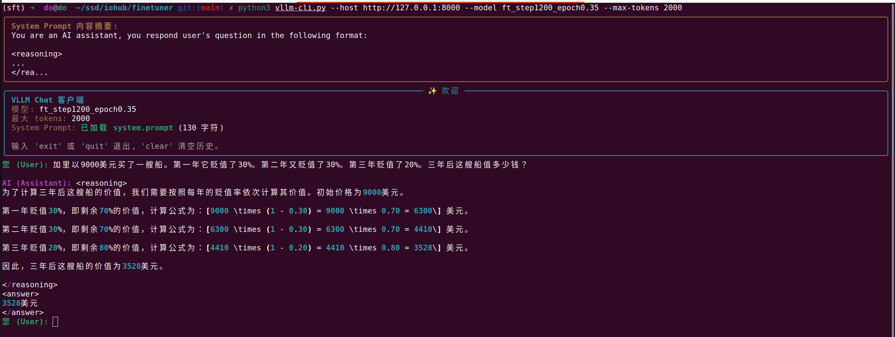

# Fine-Tuning examples for Large Language Models

This repository provides examples for fine-tuning large language models (LLMs) using various preference-based and reinforcement learning algorithms. Built with Unsloth optimizations for efficient GPU training, it supports multiple model families including Gemma3 and Qwen2.5-r1.

## Core Functionality

- **Multiple Training Algorithms**: Supports DPO (Direct Preference Optimization), PPO (Proximal Policy Optimization), KTO (Kahneman-Tversky Optimization), XPO, NashMD, RLOO, and Online DPO.
- **Model Support**: Optimized for Gemma3 and Qwen2.5 model families with modular architecture for easy extension to other models.
- **Inference Tools**: Command-line interface for model inference using vLLM.
- **Visualization**: Plotting scripts for analyzing training logs and reward dynamics.


## Directory Structure

```
├── gemma3/                    # Gemma3 model specific files
├── qwen2.5-r1/               # Qwen2.5-r1 model specific files
├── stacoder2/                # StarCoder2 model specific files
├── imgs/                     # Visualization assets
├── plot_log.py              # Script for plotting training logs
├── vllm-cli.py              # Command-line interface for inference
```

## Examples

### *Aha moment on finetuned Qwen2.5-3B*
<br>